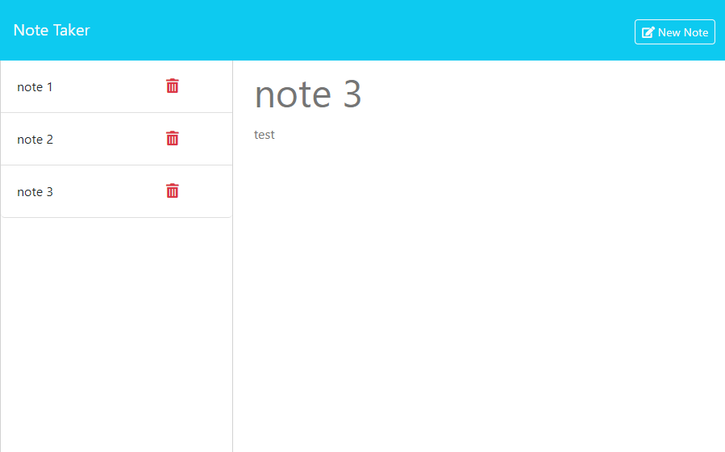

[?labelColor=hsl(120,0%,20%)&style=for-the-badge)](https://opensource.org/licenses/MIT)


# Bcs-Note-Taker



<br>

## Description

This is a simple app to take notes

Application is live at: https://bcs-note-taker.onrender.com/

<br>

## Table of Content
- [Technologies](#technologies)
- [Getting Started](#getting-started)
- [Installation](#installation)
- [Usage](#usage)
- [Author](#author)
- [Acknowledgments](#acknowledgments)
- [Contribution](#contribution)
- [Questions](#questions)
- [License](#license)

<br>

## Technologies


  

<br>


## Getting Started

This section will guide you through setting up the project locally.

### Prerequisites

Before you begin, ensure you have the following installed:

- [Node.js](https://nodejs.org/) (v14.0 or later)

- [Git](https://git-scm.com/)

- A text editor like [VSCode](https://code.visualstudio.com/)

<br>

## Installation
Follow these steps to get your development environment set up:
```bash
git clone https://github.com/febres0492/bcs-note-taker.git
cd bcs-note-taker
npm install
```

<br>

## Usage
```bash
npm start
```

<br>

## Author
Carlos Febres

<br>

## Acknowledgments
The starter code was provided by Boot Camp Spot so that I could add backend functionality.

<br>

## Contribution
Contributions are welcome.  
Please get in contant for details on our code of conduct, and the process for submitting pull requests to us.

<br>


## Questions
**For questions please get in contant:**  
Github Profile: https://github.com/Febres0492  
Email: Febres0492@gmail.com

<br>


## License

[?labelColor=hsl(120,0%,20%)&style=for-the-badge)](https://opensource.org/licenses/MIT)

This project is licensed under the MIT License - see the [LICENSE](https://opensource.org/licenses/MIT) for details.